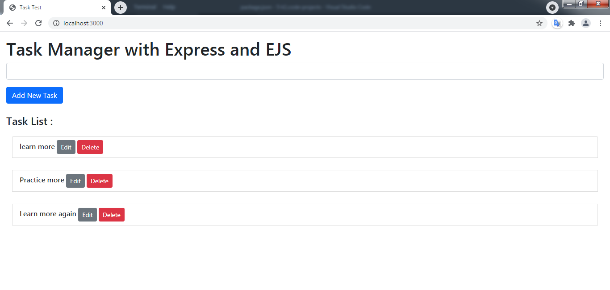
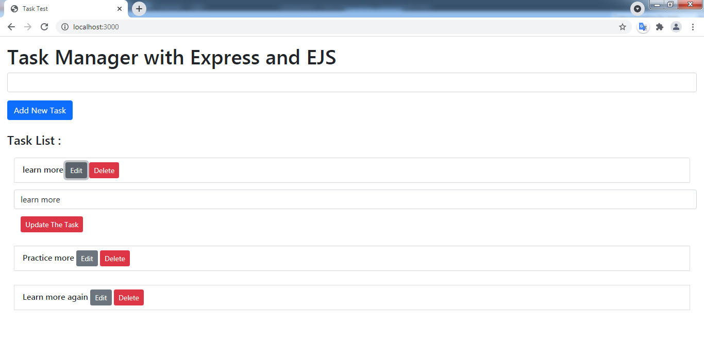

# Simple Task Manager with NodeJs
Simple Task Manager(ToDoList) created with Node.js MongoDB Database and Express EJS Mongoose packages.

### Introduction :
It's a simple To Do List, for one client. Server running by Express, and main page is by EJS, and data is stored in Local MongoDB.

### Technologies :
* Node.js
* MongoDB
* mongoose
* EJS
* Bootstrap

### Requirements :
To run the project you need to have installed NodeJs, MongoDB.

### Screenshots :

### Run the app
after stablishing MongoDB databsase

Open terminal in the project folder

// to install packages :

$npm install

// to run the app :

$node app.js

// open the browser on port 3000

http://localhost:3000/

// To stop the server :
just press Ctrl+C in Terminal

